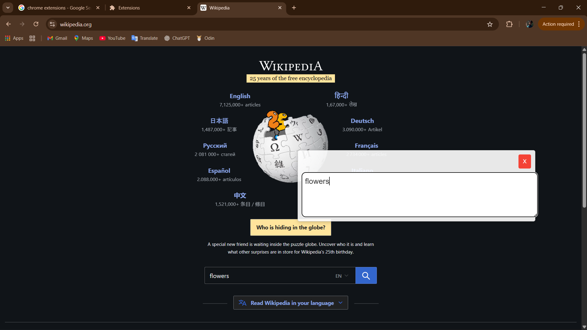
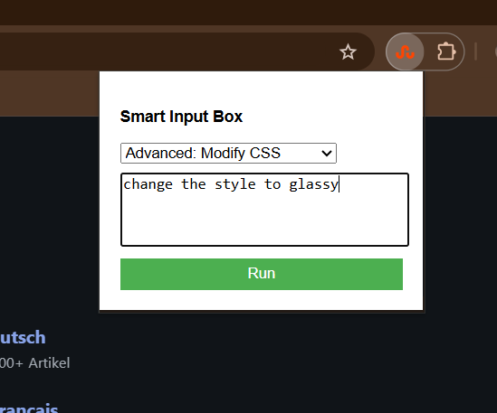

# 🚀 Custom Input Box Extension

A browser extension that adds a floating custom input box over any input field.  
It supports a **Normal Mode** for syncing with inputs and an **Advanced Mode** powered by LLMs to modify CSS and summarize page content.

---

## 🛠 Tech Stack

- Web Extension APIs
- JavaScript
- HTML
- CSS
- LLM Integration

---

## ⚙️ How to Run on Your Device

1. Clone or pull the repository from GitHub  
2. Open **Chrome** and go to: `chrome://extensions/`  
3. Enable **Developer mode** (top right)  
4. Click **Load unpacked**  
5. Select the project folder  
6. The extension is now ready to use 🎉

---

## 🖼 Reference Images

### 🔹 Basic Feature

  

### 🔹 Advanced Feature

  

